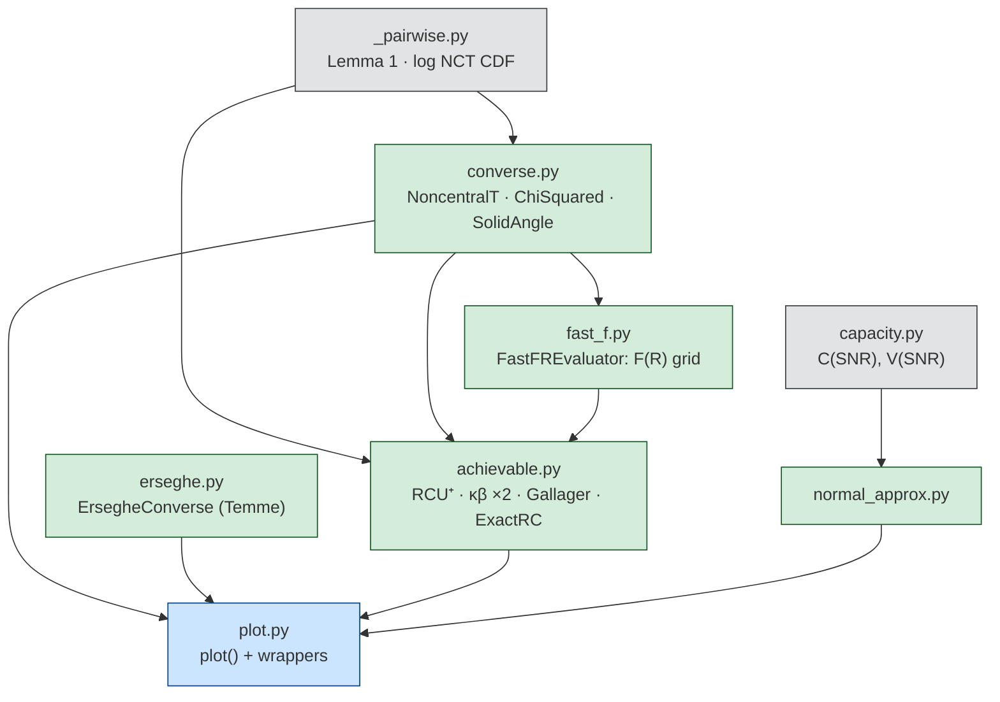
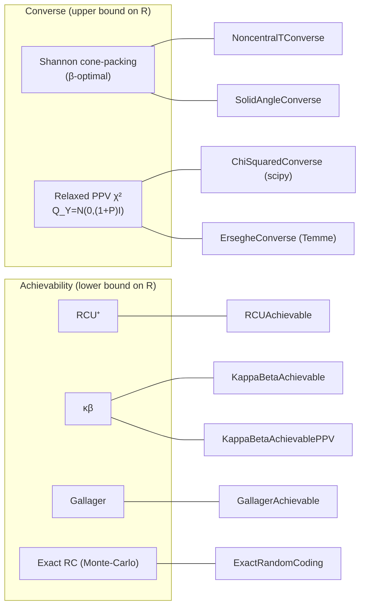
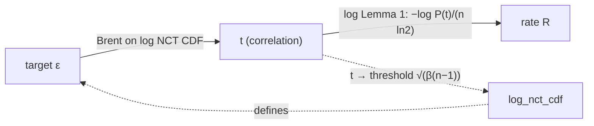
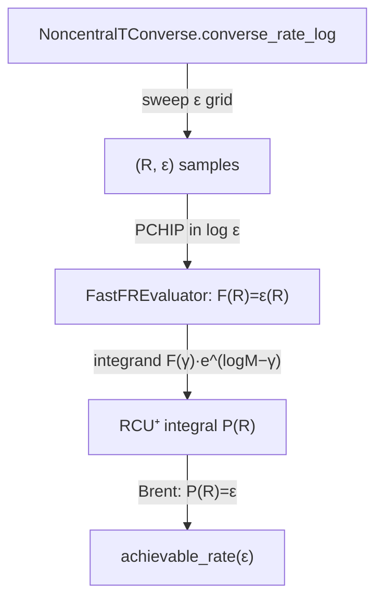

# Architecture

How the `awgn_fbl` package is organised, what each module computes, and the
two pipelines (converse and RCU⁺) that everything else hangs off.  The math
behind each step is in the [chapter](docs/chapter/) and the
[notes](docs/notes/); this file is the map.

---

## Module layers

The package is a small dependency DAG — primitives at the bottom, presentation
at the top.  An arrow `A → B` means *B imports A*.

| Layer | Module | Responsibility |
|---|---|---|
| **primitives** | `capacity.py` | Shannon capacity `C = ½log₂(1+SNR)` and dispersion `V`. |
| | `_pairwise.py` | the two shared kernels: **Lemma 1** pairwise error `P(ρ̂≥t)` (linear + log) and the **log non-central t CDF/SF** (integral representation). |
| **converse** | `converse.py` | `NoncentralTConverse` (cone-packing, linear + log paths), `ChiSquaredConverse` (relaxed `Q_Y`, scipy), `SolidAngleConverse` (Shannon's original form). |
| | `erseghe.py` | `ErsegheConverse` — the relaxed `Q_Y` converse evaluated by Temme's method; standalone (scipy only). |
| | `normal_approx.py` | the second-order normal approximation (not a bound). |
| **evaluator** | `fast_f.py` | `FastFREvaluator` — precomputes the converse curve `F: R↦ε` once and serves microsecond lookups for the RCU⁺ integrand. |
| **achievability** | `achievable.py` | `RCUAchievable`, `KappaBetaAchievable(PPV)`, `GallagerAchievable`, `ExactRandomCoding`, plus the log non-central χ² helper `_log_ncx2_cdf_series`. |
| **presentation** | `plot.py` | one `plot()` dispatcher over the four variables `(n, SNR, ε, R)`, plus thin wrappers. |

Everything is constructed with the same `(n, snr_db)` signature and is pure
NumPy/SciPy — no global state, no I/O outside `plot.py`.

---

## The bounds, and which class evaluates which

Several bounds have **two implementations** (a simple/scipy oracle and a robust
log-domain default); the test suite cross-checks each pair.  See the *Bounds
inventory* table in the [README](README.md#bounds-inventory--implementations-and-cross-checks).

---

## Pipeline 1 — the converse, `ε → R`

`NoncentralTConverse.converse_rate_log(ε)` is the spine of the library.  It is a
parametric curve in `t ∈ (0,1)` with two independent maps that meet at `t`:

1. **`t → ε`** (`_log_eps_forward`): map `t` to the NCT threshold and evaluate
   `log_nct_cdf` — the integral representation
   `F(x|ν,μ) = E_{X∼χ²_ν}[Φ(x√(X/ν) − μ)]` on a log-uniform `X`-grid, which
   stays in log-domain throughout (unlike scipy's `nct.logcdf`).
2. **invert** with `scipy.optimize.brentq` to find the `t` with `ε(t) = ε`
   (never calls `nct.ppf`, so no NaN wall).
3. **`t → R`** (`log_pairwise_error_prob`, Lemma 1): `R = −log P(ρ̂≥t)/(n ln2)`,
   the log-sum-exp of `(1−n)/2·log(1+t²tan²θ)` over a concentrated `θ`-grid.

The reverse direction `R → ε` (`log_converse_error`) swaps the two: Brent on
Lemma 1 to hit a target `log P`, then the forward log-NCT map.

---

## Pipeline 2 — RCU⁺ achievability

RCU⁺ reuses the *exact* converse curve `F(R)` of pipeline 1:

1. **`FastFREvaluator`** sweeps an adaptive `ε`-grid, evaluates
   `converse_rate_log` at each, and fits a monotone **PCHIP** interpolant in
   `log ε` — turning the expensive converse into microsecond lookups.
2. **RCU⁺ integral** (`RCUAchievable`):
   `P(log M) = ∫_{log M}^∞ F(γ)·e^{log M − γ} dγ`.
   The log-safe path uses the **`F·J` factorisation** `P = F(R)·J(R)` with
   `J ∈ [1, 1/F(R)]`, so `log P = log F + log J` is a sum of two
   well-conditioned terms.  Its deep-tail reach is set by the depth of the
   `F(R)` grid (`eps_min`).
3. **`achievable_rate(ε)`** root-finds `P(R) = ε`, capped at the converse rate.

`ExactRandomCoding` provides an independent Monte-Carlo check of this integral
(`E_T[min(1,(M−1)G(T))]` vs `E_T[1−(1−G(T))^{M−1}]`).

---

## The other achievability bounds (standalone)

| Bound | Algorithm |
|---|---|
| **κβ** (`KappaBeta*`) | `log M = max_τ [log₂κ(τ) − log₂β_q(τ)]`; `κ` via `erfinv`/`erf`, `β_q` via non-central χ² `isf`/`sf` and the saddle-point Poisson-mixture `_log_ncx2_cdf_series`.  See [docs/notes/kappabeta-log-domain.md](docs/notes/kappabeta-log-domain.md). |
| **Gallager** | two-regime closed-form exponent `E_r(R,ρ)`; `log P_e = log μ − n·E_r`, the prefactor `μ` a central-χ² difference near the mean. |
| **Erseghe** | the relaxed χ² converse via Temme's single integral `log P = log|g| − ½n·v`.  See [docs/notes/alternative-evaluations.md](docs/notes/alternative-evaluations.md). |
| **Normal approx.** | `R ≈ C − √(V/n)·Q⁻¹(ε) + log₂(n)/(2n)` (not a bound). |

---

## Presentation

`plot.plot(curves, x=…, y=…, **fixed)` fixes two of the four variables
`(n, snr_db, epsilon, rate_bits)`, sweeps a third on the x-axis, and computes
the fourth — covering every axis combination through one dispatcher
(`_rate_for`, `_error_for`, `_invert_for_snr`, `_invert_for_n`).  The thin
wrappers (`plot_rate_vs_snr`, `plot_error_vs_snr`, …) name the common cases.
`generate_chapter_figures.py` (chapter figures) and `analysis/stress_plots.py`
(stress sweeps) drive it.

---

## Notes on the diagrams

The mermaid blocks above are the current, authoritative picture.  The PNGs in
[`docs/diagrams/`](docs/diagrams/) predate the package restructure and use the
old single-file names (`awgn_converse.py`, `rcu_achievable.py`, …); prefer this
file.
