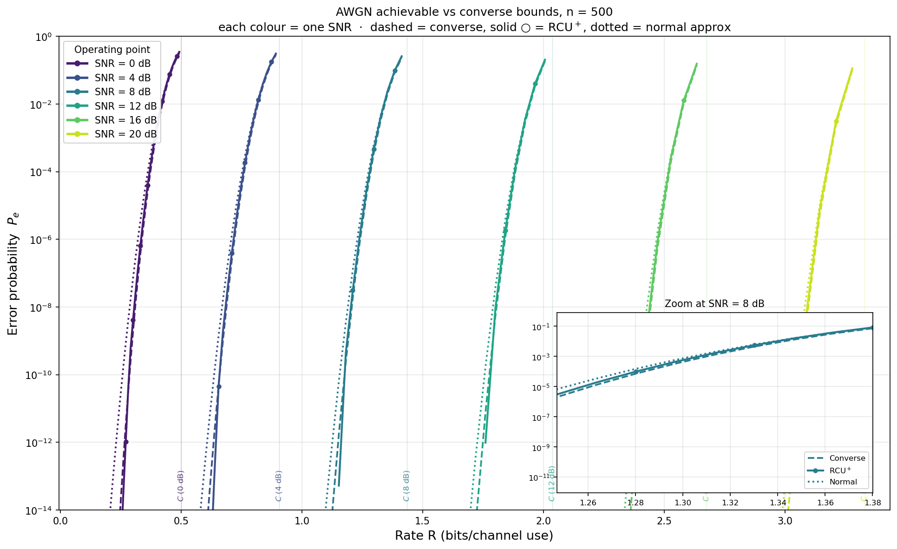
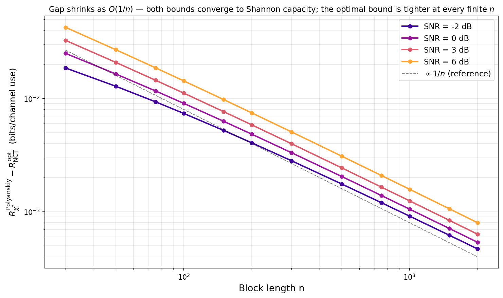

# awgn_fbl — Finite-blocklength bounds for the AWGN channel

Numerical evaluation of converse and achievability bounds on the maximum coding rate of the real-valued AWGN channel at finite blocklength `n`.

This repository accompanies the PhD thesis of **Nir Elkayam** and provides clean, tested implementations of the principal information-theoretic bounds for the AWGN channel — including a novel **RCU+ achievable bound** that is significantly tighter than existing alternatives, and a numerically robust log-domain evaluation of **Shannon's 1959 cone-packing converse** (the optimal AWGN converse) that extends the working range far beyond what `scipy.stats.nct` alone can handle.

A self-contained version of the thesis chapter is included in `docs/chapter/`.

---

## At a glance

At the reference operating point `n = 200`, `SNR = 0 dB`, `ε = 10⁻³`:

| Bound | Rate (bits/use) | Gap to capacity |
|---|---|---|
| Shannon capacity | 0.5000 | — |
| Shannon cone-packing converse † | 0.3456 | 0.154 |
| **RCU⁺ achievable (ours)** | **0.3365** | **0.164** |
| Normal approximation | 0.3261 | 0.174 |
| κβ (Polyanskiy) | 0.2837 | 0.216 |
| Gallager | 0.2540 | 0.246 |

† The converse is Shannon's 1959 cone-packing bound — the *optimal* AWGN converse, and the PPV meta-converse with the channel-optimal output distribution (Erseghe 2015).  The contribution is its robust log-domain evaluation (`NoncentralTConverse`), not the bound itself.

RCU⁺ comes within **0.009 bits/use** of the converse — about an order of magnitude tighter than alternative achievable bounds.  Because that converse is the strongest possible one, the sandwich is essentially tight.  See **[RESULTS.md](RESULTS.md)** for the full multi-operating-point tables and figures, or `plots/chapter/showcase_waterfall_n500.png` for the flagship picture.

---

## Repository layout

```
GaussianSim/
├── README.md                          ← you are here
├── RESULTS.md                         ← numerical results + figure index
├── LICENSE                            ← MIT
├── pyproject.toml                     ← installable package metadata
├── requirements.txt                   ← runtime + test deps
├── generate_chapter_figures.py        ← single script: all thesis figures
│
├── awgn_fbl/                          ← the library (path-based import)
│   ├── _pairwise.py                   ← Lemma 1, log_nct_cdf primitives
│   ├── capacity.py                    ← Shannon C, channel dispersion V
│   ├── converse.py                    ← NCT, χ², SolidAngle converse classes
│   ├── achievable.py                  ← RCU+, κβ ×2, Gallager, ExactRC
│   ├── normal_approx.py               ← second-order asymptotic
│   ├── fast_f.py                      ← FastFREvaluator (precomputed F(R))
│   └── plot.py                        ← plot() + curve registry
│
├── tests/                             ← 180 tests, all passing
├── analysis/                          ← stress tests + sanity checks (diagnostic)
│
├── plots/
│   ├── chapter/                       ← thesis figures (output of the top script)
│   └── stress/                        ← stress-test output (analysis/)
│
└── docs/
    ├── chapter/                       ← self-contained thesis-chapter LaTeX
    │   ├── main.tex                   ← standalone driver
    │   ├── chapter_awgn.tex           ← chapter body
    │   ├── _preamble.tex              ← minimal macros (no thesis dependency)
    │   └── main.pdf                   ← compiled standalone (tracked)
    └── diagrams/                      ← architecture diagrams (mermaid + png)
```

---

## Install

```bash
git clone https://github.com/nire123/awgn-fbl.git
cd awgn-fbl
pip install -e .          # installs awgn_fbl + numpy/scipy/matplotlib
pip install -e ".[test]"  # also pulls pytest for the test suite
```

`pip install -e .` puts `awgn_fbl` on the import path from anywhere; the
snippets below then work regardless of the current directory.  (If you prefer
not to install, the package also imports directly when run from the repo
root.)

---

## Quick start

```python
from awgn_fbl import NoncentralTConverse, RCUAchievable

conv = NoncentralTConverse(n=200, snr_db=0.0)
rcu  = RCUAchievable(n=200, snr_db=0.0)

R_upper = conv.converse_rate_log(epsilon=1e-3)   # 0.3456 bits/use
R_lower = rcu.achievable_rate(epsilon=1e-3)      # 0.3365 bits/use
# Gap ≈ 0.009 bits/use — fundamental limit essentially resolved.
```

R → ε direction:

```python
conv.converse_error_log(rate_bits=0.3)     # min error prob at R = 0.3
rcu.achievable_error(R_bits=0.3)           # RCU+ error prob at R = 0.3
```

Plotting:

```python
from awgn_fbl import plot_rate_vs_snr

fig, ax = plot_rate_vs_snr(
    n=200, epsilon=1e-3,
    curves=["capacity", "converse_nct", "rcu", "gallager",
            "kappabeta_ppv", "normal"],
)
fig.savefig("rate_vs_snr.png")
```

To regenerate every chapter figure:

```bash
python generate_chapter_figures.py
# Output: plots/chapter/*.png
```

---

## Bounds implemented

### Converse (upper bounds on rate)

**The converse here is Shannon's cone-packing bound.**  For an equal-power
(spherical) AWGN codebook the maximum-likelihood decision regions are circular
cones around each codeword, and Shannon's 1959 sphere/cone-packing argument
gives the *optimal* converse — the error probability of the best code is
exactly a **non-central t** tail.  This is the strongest known converse for the
AWGN channel, and Polyanskiy–Poor–Verdú's meta-converse, evaluated with the
channel-optimal output distribution, **coincides with it** for this channel
(Erseghe 2015).  `NoncentralTConverse` is therefore not a new bound: the
contribution is a numerically robust **log-domain** evaluation of Shannon's
cone-packing converse that stays accurate far past where scipy's linear NCT
breaks down.

| Class | Method | Notes |
|---|---|---|
| `NoncentralTConverse` | **Shannon 1959 cone-packing bound**, evaluated via the non-central t distribution | The optimal AWGN converse.  Linear *and* log-domain methods; log-domain extends the range beyond scipy's NCT NaN wall.  Equivalent to the PPV meta-converse with the optimal `Q_Y` (Erseghe 2015). |
| `ChiSquaredConverse` | PPV meta-converse with the *relaxed* `Q_Y = N(0,(1+P)·I)` | Not β-optimal, so strictly looser than the cone-packing bound at any finite n; kept as a reference to quantify the relaxation cost. |
| `SolidAngleConverse` | Shannon 1959 cone-packing in its original solid-angle form `Ω_N(θ)/Ω_N(π)` | Exhibits the cone geometry directly; numerically reliable only for `n ≤ 80` (warns otherwise). |

### Achievability (lower bounds on rate)

| Class | Method | Error type |
|---|---|---|
| `RCUAchievable` | One-shot meta-converse integral, our flagship bound. Linear and log-safe paths. | average |
| `KappaBetaAchievable` | Simple reference port of Polyanskiy's κβ | maximal |
| `KappaBetaAchievablePPV` | Faithful PPV port (Newton-iterate β + log-domain fallback) | maximal |
| `GallagerAchievable` | Gallager random-coding, two-regime closed form | average |
| `ExactRandomCoding` | Monte-Carlo `E[1 − (1−G(T))^(M-1)]` | average |

Plus `normal_approx_rate` / `normal_approx_error` (second-order asymptotic, not a bound).

### Simple-reference / efficient-production split

A consistent design rule: where a bound has both a direct linear implementation and a more involved log-domain or PPV-faithful implementation, both are kept.  The simple version is a test oracle (cross-checked against the efficient one in the shared regime); the efficient version is the recommended default.

| Bound | Simple reference | Efficient / faithful |
|---|---|---|
| NCT converse | `converse_rate(eps)` (linear scipy NCT) | `converse_rate_log(eps)` (log-domain) |
| RCU⁺ | `achievable_error(R)` (linear quad) | `log_achievable_error(R)` (Elkayam factorisation) |
| κβ | `KappaBetaAchievable` (one-shot quantile) | `KappaBetaAchievablePPV` (Newton iteration, log fallback) |

---

## Showcase

`plots/chapter/showcase_waterfall_n500.png` — the flagship figure: converse / RCU⁺ / normal approximation tracking each other across six SNRs from 0 to 20 dB:



`plots/chapter/mismatch_gap_vs_n.png` — the relaxation cost of Polyanskiy's `Q_Y` choice relative to the optimal sphere-packing converse, scaling as `O(1/n)`:



---

## Tests

```bash
pytest tests/ -q
```

180 tests covering:

* **Cross-validation**: NCT vs χ² converse, log-domain vs linear, scalar vs vectorised, simple vs PPV-faithful κβ, exact RC vs RCU⁺ envelope.
* **Polyanskiy reference points**: Gallager `n=3000, ε=10⁻⁶ → log M = 1225`, κβ_PPV β formula matches `betaq_up_v2.m`.
* **Round-trip identities**: `achievable_error(achievable_rate(ε)) ≈ ε`, `log F` interpolator is exact at grid nodes.
* **Monotonicity** of every bound in n, ε, SNR, R.
* **Tail extension**: log-domain Lemma 1 finite where linear underflows; log_nct_cdf cross-validated against `scipy.stats.t` at `nc = 0`.
* **Solid-angle vs NCT** at small n: relative error below 10⁻¹⁰.

Suite runs in 5–10 minutes.

---

## Numerical notes

* **NCT converse** linear path is stable for `n ≲ 1000` at `SNR ≲ 6 dB`; the log-domain path extends this to arbitrarily large n (verified to n = 5000).
* **scipy's `nct.logcdf` / `ncx2.logcdf` are not log-stable** — they are implemented as `log(cdf(x))` and inherit the underflow.  The library's `log_nct_cdf` uses the integral representation `E_X[Φ(x·√(X/df) − nc)]` on a log-uniform X-grid and stays accurate where scipy fails.
* **RCU⁺ integral** uses the factorisation `P(R) = F(R) · J(R)` with `J ∈ [1, 1/F(R)]`; `log P(R)` is then `log F(R) + log J(R)`, two well-conditioned terms.
* **F evaluator** uses PCHIP interpolation in log(ε) on a geometric grid (~220 points by default, factor 0.9 per step).  Empirical error: ~3.6 ppm in log(ε); a 5× refinement of the grid changes the final RCU⁺ rate by ~10⁻¹⁰ bits/use.

---

## Self-contained chapter PDF

To compile the chapter from this repo:

```bash
cd docs/chapter
pdflatex main.tex && pdflatex main.tex   # twice for cross-references
```

Output: `docs/chapter/main.pdf` (17 pages, includes all figures).

---

## Scope

**Is**: a tested numerical reference for the principal AWGN finite-blocklength bounds.

**Is not**: a coding simulator (no encoders/decoders), and not a multi-channel library — BSC / BEC / Rayleigh / MIMO are out of scope.

---

## Citation

```bibtex
@phdthesis{elkayam,
  author = {Nir Elkayam},
  title  = {[thesis title]},
  school = {[institution]},
  year   = {2026}
}
```

Foundational references:

- C. E. Shannon, "Probability of error for optimal codes in a Gaussian channel," *Bell System Technical Journal*, 1959 — the **cone-packing converse** that `NoncentralTConverse` evaluates.
- Y. Polyanskiy, H. V. Poor, S. Verdú, "Channel coding rate in the finite blocklength regime," *IEEE Trans. Inf. Theory*, 2010 — the meta-converse, which for the AWGN channel specializes to Shannon's cone-packing bound.
- T. Erseghe, "On the evaluation of the Polyanskiy–Poor–Verdú converse bound for finite blocklength coding in AWGN," *IEEE Trans. Inf. Theory*, vol. 61, no. 12, pp. 6578–6590, 2015 — establishes the PPV ≡ Shannon cone-packing equivalence and a non-central χ² evaluation. [arXiv:1401.7169](https://arxiv.org/abs/1401.7169)
- Sphere/cone-packing converse for the Gaussian channel (University of Plymouth PEARL repository): <https://pearl.plymouth.ac.uk/cgi/viewcontent.cgi?article=2720&context=secam-research>
- R. G. Gallager, *Information Theory and Reliable Communication*, Wiley, 1968.
- Polyanskiy's SPECTRE toolbox: <https://github.com/yp-mit/spectre>

---

## Dependencies

- `numpy`
- `scipy`
- `matplotlib`
- `pytest` (for tests)

Python 3.10+.  Exact floors are pinned in `pyproject.toml` / `requirements.txt`.

---

## License

Released under the [MIT License](LICENSE) — © 2026 Nir Elkayam.  Free to use,
modify, and redistribute with attribution; no warranty.
