# Results

Numerical results for the AWGN finite-blocklength bounds in `awgn_fbl`.
Every number and figure below is **reproducible** from the library — there is
no hand-tuned data.

```bash
pip install -e .
python generate_chapter_figures.py     # regenerates every figure in plots/chapter/
python analysis/stress_plots.py         # regenerates the stress/ sweeps
pytest tests/ -q                        # 180 tests, ~4 min
```

All rates are in **bits/channel use**; `C = ½·log₂(1 + SNR)` is the Shannon
capacity. Converse is an **upper** bound on the achievable rate, the
achievability bounds (RCU⁺, κβ, Gallager) are **lower** bounds, and the normal
approximation is a (non-rigorous) benchmark that sits between them.

---

## 1. Headline result

At the reference operating point `n = 200`, `SNR = 0 dB`, `ε = 10⁻³`:

| Bound | Rate | Gap to capacity |
|---|---|---|
| Shannon capacity | 0.5000 | — |
| **NCT converse (ours)** | **0.3456** | 0.154 |
| **RCU⁺ achievable (ours)** | **0.3365** | 0.164 |
| Normal approximation | 0.3261 | 0.174 |
| κβ (Polyanskiy, PPV-faithful) | 0.2837 | 0.216 |
| Gallager | 0.2540 | 0.246 |

The **converse → achievability gap is 0.0092 bits/use** — the two bounds
sandwich the true maximum coding rate to within ~1% of capacity, roughly an
order of magnitude tighter than the next-best achievability bound (κβ).

### Across operating points

Computed directly from the library (`NoncentralTConverse.converse_rate_log`,
`RCUAchievable.achievable_rate`, `KappaBetaAchievablePPV`,
`GallagerAchievable`, `normal_approx_rate`):

| n | SNR (dB) | ε | C | Converse | RCU⁺ | Normal | κβ (PPV) | Gallager |
|---:|---:|---:|---:|---:|---:|---:|---:|---:|
| 200 | 0 | 10⁻³ | 0.5000 | 0.3456 | 0.3365 | 0.3261 | 0.2837 | 0.2540 |
| 500 | 0 | 10⁻³ | 0.5000 | 0.3949 | 0.3916 | 0.3869 | 0.3688 | 0.3351 |
| 1000 | 0 | 10⁻³ | 0.5000 | 0.4227 | 0.4211 | 0.4186 | 0.4092 | 0.3801 |
| 200 | 3 | 10⁻³ | 0.7913 | 0.6179 | 0.6090 | 0.6003 | 0.5535 | 0.5098 |
| 500 | 3 | 10⁻⁶ | 0.7913 | 0.6100 | 0.6065 | 0.5959 | 0.5653 | 0.5554 |

* **The converse/RCU⁺ gap shrinks with n** — 0.0092 at `n=200`, 0.0033 at
  `n=500`, 0.0016 at `n=1000` (SNR 0 dB, ε = 10⁻³). RCU⁺ tracks the converse
  to `O(1/n)`.
* **RCU⁺ beats the normal approximation everywhere**, as a true bound should,
  while κβ and Gallager are progressively looser — the cost of their
  respective relaxations.

---

## 2. Flagship — converse vs RCU⁺ across SNR


**`showcase_waterfall_n500.png`** — error probability `P_e` vs rate `R` at
`n = 500`, for six SNRs from 0 to 20 dB (one colour each). Dashed = NCT
converse, solid ○ = RCU⁺, dotted = normal approximation; thin vertical lines
mark capacity at each SNR. The zoom inset (SNR = 8 dB) shows that the converse
and RCU⁺ curves are visually indistinguishable down to `P_e ≈ 10⁻¹⁴` — the
achievability and converse essentially coincide across the whole operating
range.

---

## 3. Bound comparisons — rate vs SNR / n / ε

All six standard curves (`capacity`, `converse_nct`, `rcu`, `gallager`,
`kappabeta_ppv`, `normal`) on common axes.

### Rate vs SNR (ε = 10⁻³)

At three blocklengths, sweeping SNR over `[-2, 10] dB`:

| n = 50 | n = 200 | n = 1000 |
|---|---|---|
| 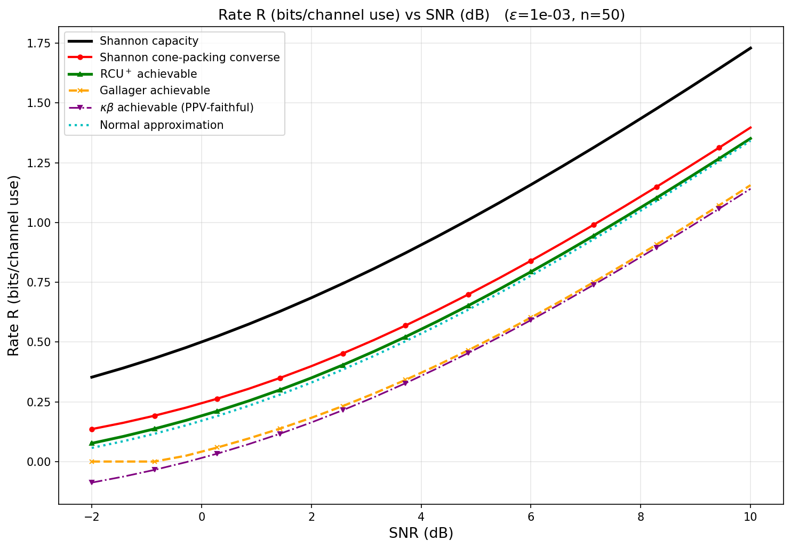 | 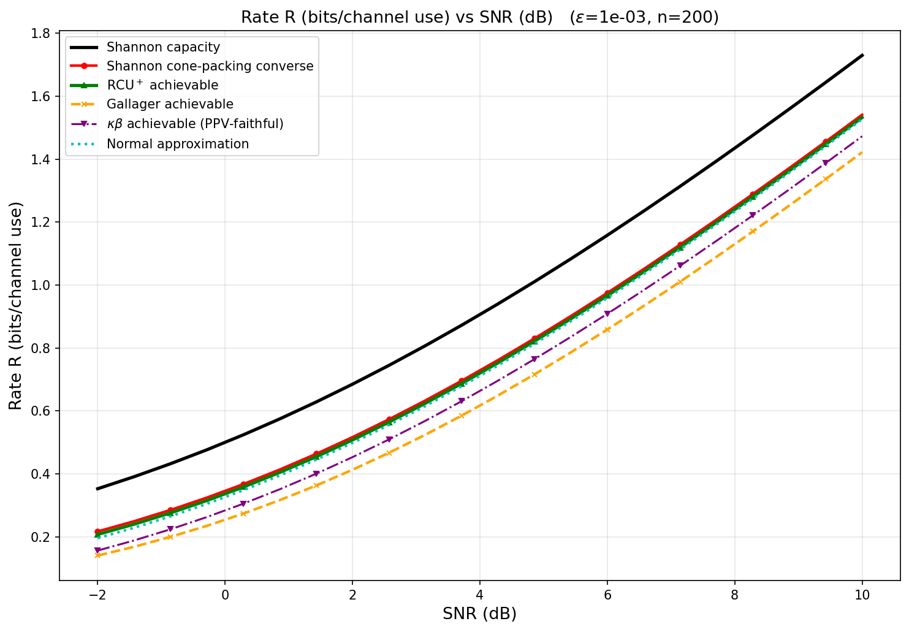 | 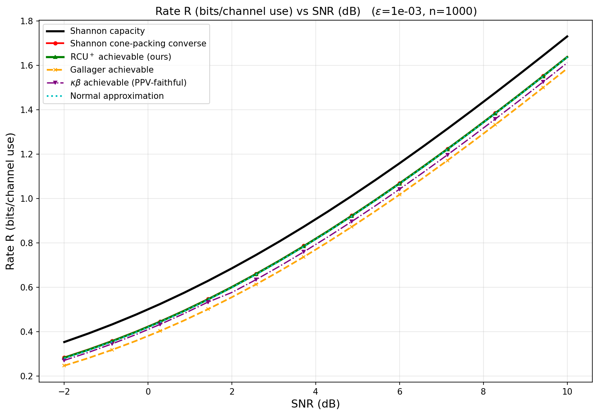 |

As `n` grows the converse and RCU⁺ curves close on each other and on capacity;
at `n = 50` the finite-blocklength penalty is large, at `n = 1000` all bounds
are tightly bunched.

### Rate vs blocklength (ε = 10⁻³)

Convergence to capacity as `n → ∞`, at two SNRs:

| SNR = 0 dB | SNR = 3 dB |
|---|---|
| 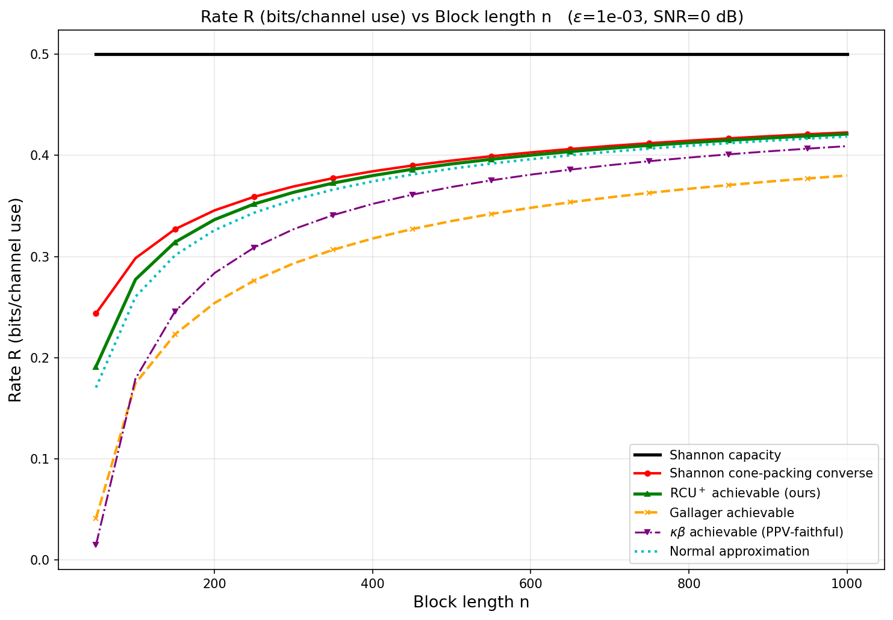 | 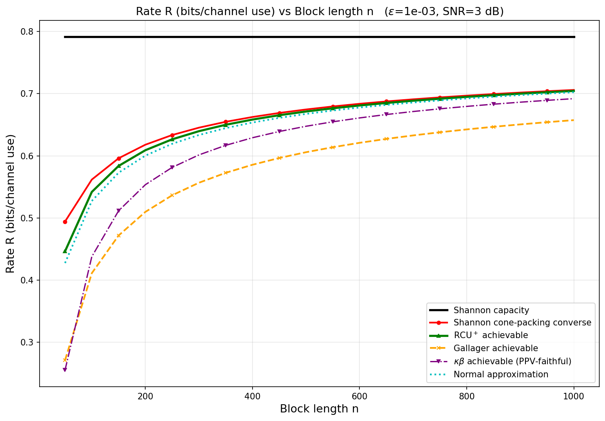 |

### Rate vs target error probability (n = 200)

Sweeping `ε` over `[10⁻⁵, 0.5]`, at two SNRs:

| SNR = 0 dB | SNR = 3 dB |
|---|---|
| 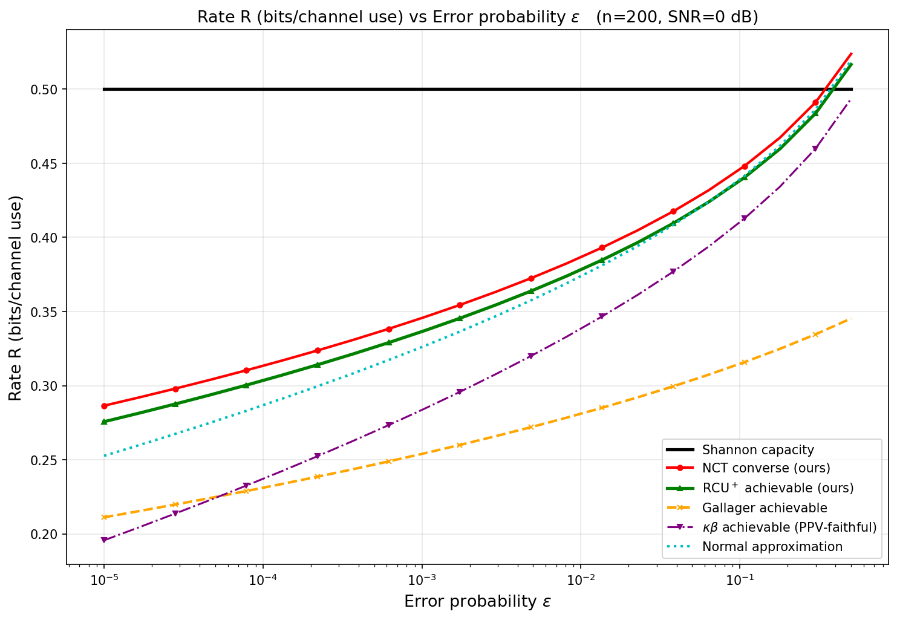 | 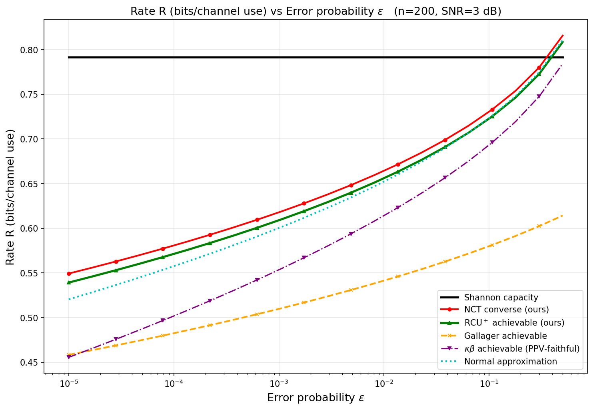 |

---

## 4. Waterfall — error probability vs SNR (fixed rate R = 0.3)

The `R → ε` direction: how error probability falls as SNR increases, at fixed
rate, for converse / RCU⁺ / normal approximation.

| n = 200 | n = 500 |
|---|---|
| 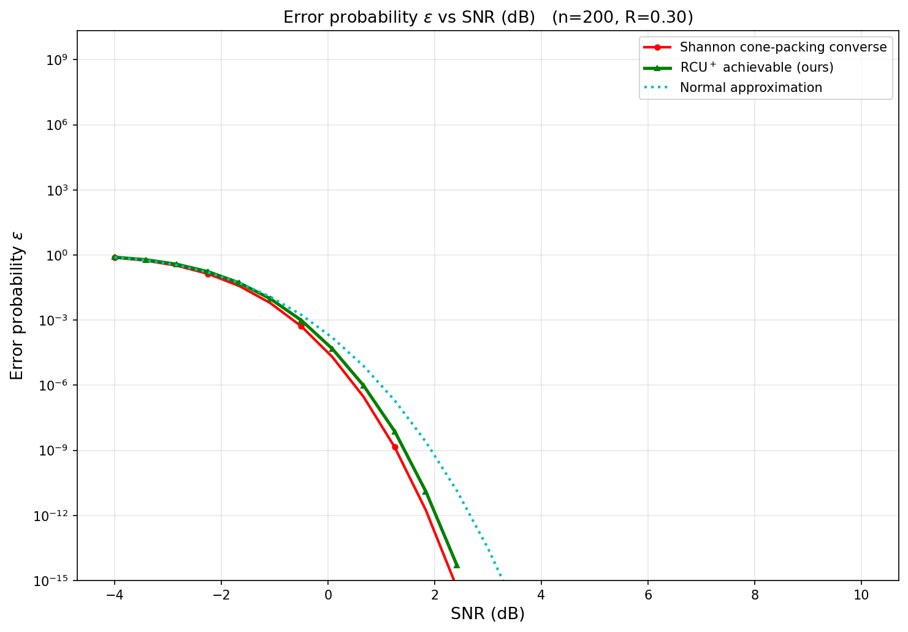 | 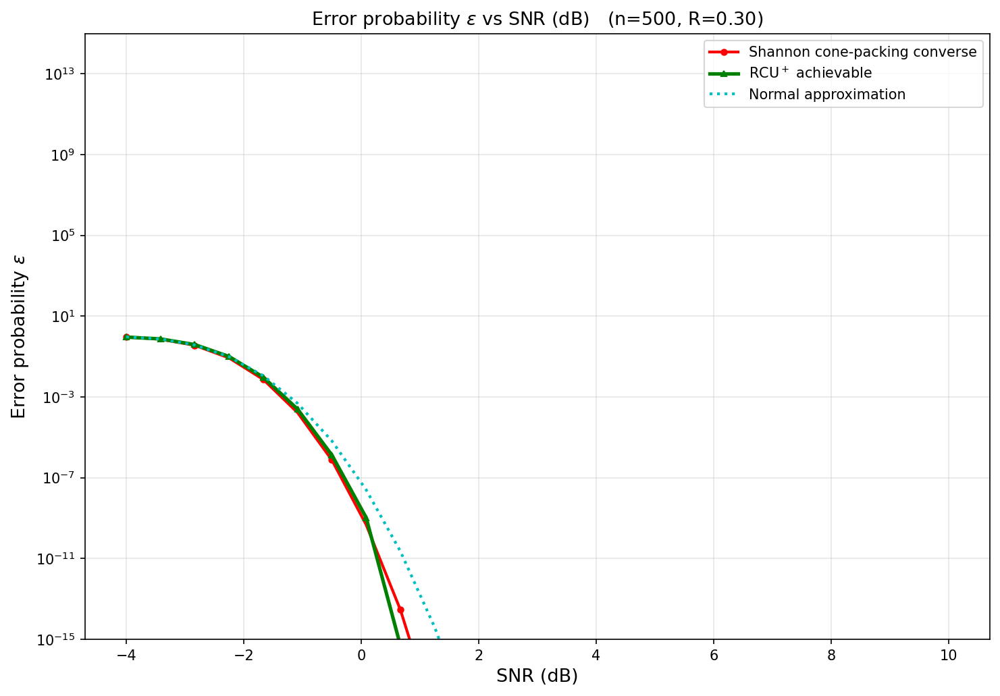 |

---

## 5. Converse optimality — relaxation cost of Polyanskiy's χ²

The standard literature converse uses the output measure
`Q_Y = N(0,(1+P)·I)`, which is not β-optimal. These figures quantify how much
rate that choice gives up relative to the optimal sphere-packing (Lemma 1 /
NCT) converse, `R_χ² − R_NCT`.

### vs SNR (ε = 10⁻³, several blocklengths)

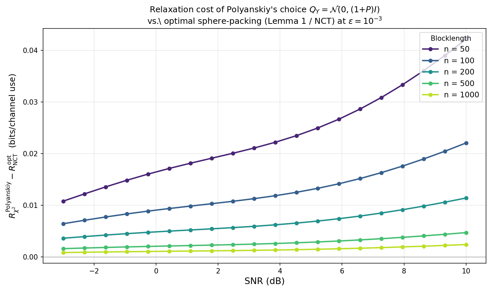

### vs blocklength (log–log, showing the O(1/n) decay)


**`mismatch_gap_vs_n.png`** — the gap decays as `O(1/n)` (dashed `∝ 1/n`
reference line): both converses converge to capacity, but the NCT converse is
strictly tighter at every finite `n`.

---

## 6. Exact random coding vs the RCU⁺ envelope (small n)

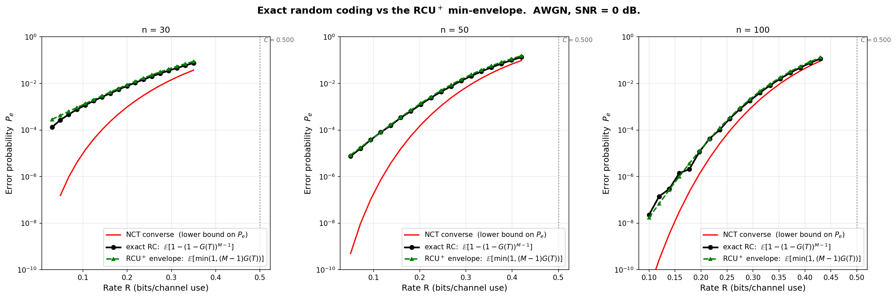

**`exact_rc_vs_bounds.png`** — at `n = 30, 50, 100` (SNR = 0 dB), the *exact*
Monte-Carlo random-coding error `E[1 − (1 − G(T))^(M−1)]` (black, 500k
samples) against the RCU⁺ min-with-1 envelope `E[min(1, (M−1)·G(T))]` (green)
and the NCT converse (red, a lower bound on `P_e`). The envelope sits just
above the exact curve — quantifying the (small) cost of the union-bound
relaxation that RCU⁺ applies, and serving as an independent Monte-Carlo
cross-check of the RCU⁺ integral form.

---

## 7. Robustness — stress and edge-case sweeps

`analysis/stress_plots.py` regenerates a broader battery under
[`plots/stress/`](plots/stress/) — ~100 figures with companion `.csv` data —
exercising the bounds far outside the comfortable regime:

* **`standard/`** — dense `rate_vs_snr`, `rate_vs_n`, `rate_vs_eps`,
  `error_vs_snr` sweeps across many `(n, SNR, ε)` combinations.
* **`inversions/`** — the inverse directions (`snr_vs_n`, `snr_vs_eps`,
  `error_vs_n`), which exercise the Brent root-finders.
* **`edge/`** — deliberately hostile operating points (below).

Two representative edge cases:

| Extreme SNR, n = 1000 | Large n (n→∞ regime), SNR = +9 dB |
|---|---|
| 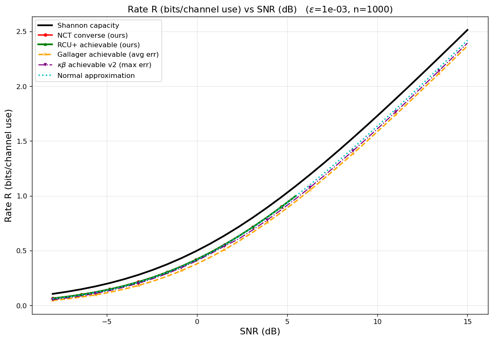 | 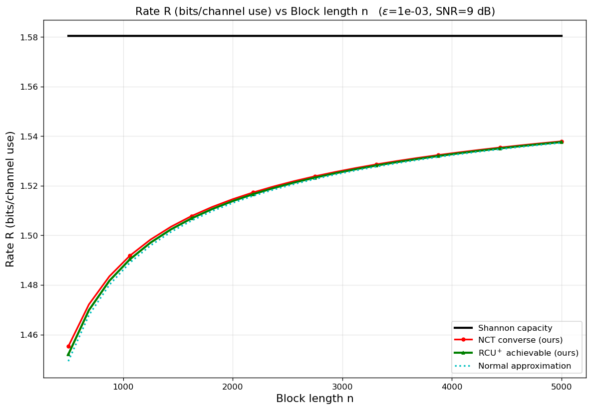 |

The `edge/` set also covers `tiny_eps` (ε down to deep tails), `small_n`,
`high_rate_waterfall`, `low_rate_waterfall`, and the `gallager_regime` — these
are where scipy's linear NCT/ncx² break down and the library's log-domain
paths take over. See the directory for the full set plus the raw `.csv`.

---

## 8. Validation

The numbers above are backed by **180 passing tests** (`pytest tests/`,
~4 min). Coverage relevant to result correctness:

* **Cross-validation** — NCT vs χ² converse, log-domain vs linear path
  (agreement ~10⁻⁶ bits/use), scalar vs vectorised Lemma 1, simple vs
  PPV-faithful κβ, exact Monte-Carlo random coding vs the RCU⁺ integral.
* **Published reference points** — Gallager `n=3000, ε=10⁻⁶ → log M = 1225`;
  κβ_PPV β-formula matches Polyanskiy's `betaq_up_v2.m`.
* **Round-trip identities** — `achievable_error(achievable_rate(ε)) ≈ ε`;
  the `log F` interpolator is exact at its grid nodes.
* **Monotonicity** of every bound in `n`, `ε`, `SNR`, `R`.
* **Tail extension** — the log-domain path stays finite where the linear path
  underflows to zero; `log_nct_cdf` cross-checked against `scipy.stats.t` at
  `nc = 0`; solid-angle vs NCT below 10⁻¹⁰ relative error at small n.

---

## 9. Numerical reach

* The **log-domain NCT converse** is verified accurate to `n = 5000`, well
  past the `n ≈ 1000` point where scipy's linear `nct.ppf` returns NaN.
* The **RCU⁺ log-safe path** (`log_achievable_error`, Elkayam factorisation
  `P = F·J`) stays accurate for `P(R)` far below `10⁻³⁰⁰`, where the linear
  integral underflows.
* The **F(R) interpolator** carries ~3.6 ppm error in `log ε`; a 5×
  grid refinement moves the final RCU⁺ rate by ~10⁻¹⁰ bits/use.
